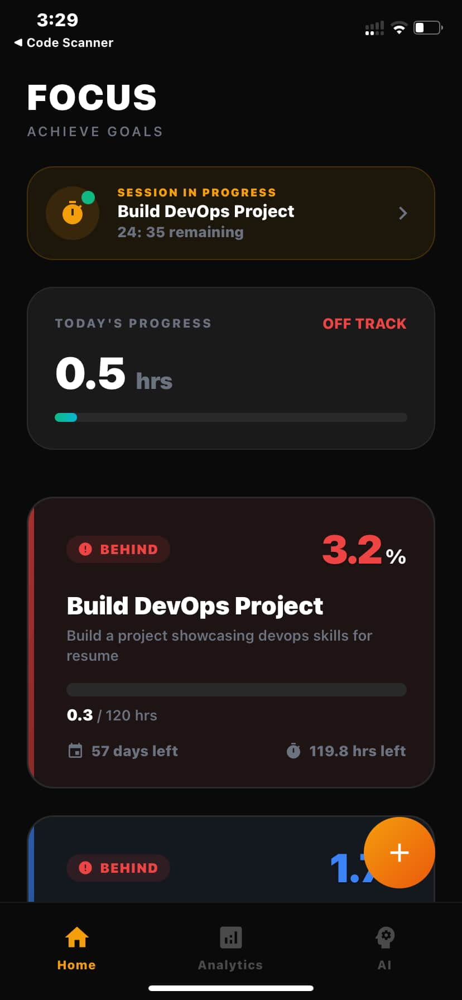
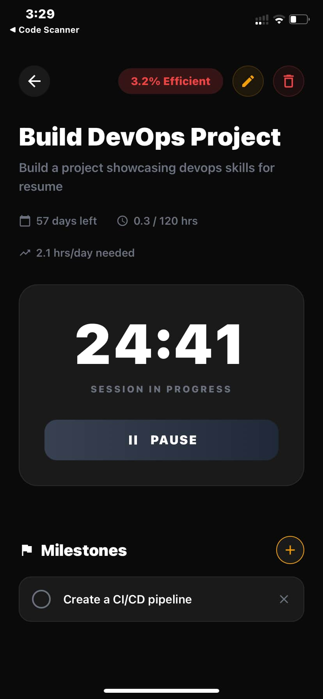
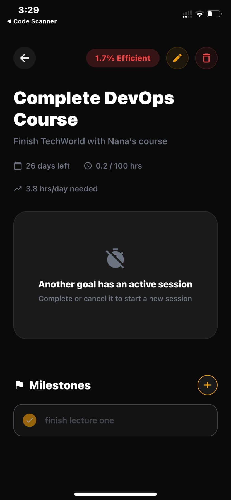
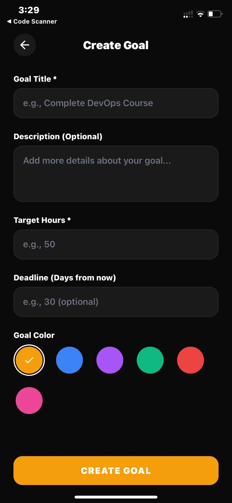
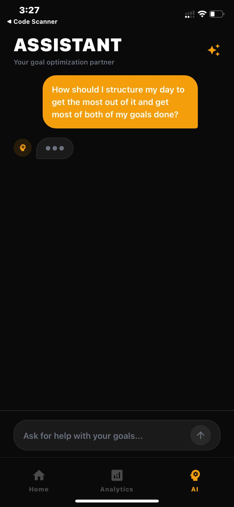
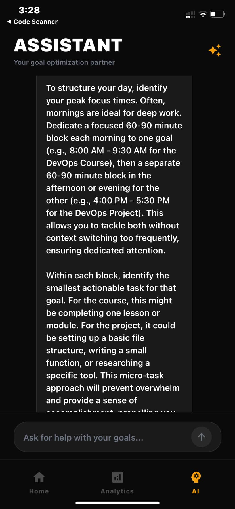

# LockedIn

A cross-platform mobile application designed to combat goal abandonment and mental clutter by helping users stay committed to their short-term goals until completion.

## The Problem
We start ambitious projects, online courses, side projects, and skill development, but rarely finish them. We jump from one goal to another, leaving a trail of unfinished achievements that create mental clutter and erode our sense of discipline.

## The Solution
LockedIn keeps your unfinished goals visible and holds you accountable. Unlike traditional todo apps that focus on daily task completion, LockedIn stays with you throughout your entire goal journey, tracking consistency and focus until you cross the finish line.

## Screenshots

### Home & Goal Management

  
  
  

### Goal Creation & Analytics

  
  

### AI Assistant

  
  

## Core Features
- **Visual Goal Stack**: All active goals displayed as stacked cards, creating a tangible representation of your commitments
- **Efficiency Tracking**: Real-time calculation based on focus time, consistency, and deadline proximity
- **Integrated Pomodoro Timer**: Start focused work sessions directly from each goal
- **Milestone Breakdown**: Break down ambitious goals into concrete, achievable tasks
- **Disciplined Aesthetic**: Dark-mode interface designed to evoke focus, clarity, and productive intensity

## Philosophy
**"Finish what you start."** LockedIn is not about doing more, it's about finishing what matters. The app creates intentional pressure through visual design, making your unfinished goals impossible to ignore while providing the structure and accountability to complete them.

## Documentation
This project includes comprehensive documentation, typically created by Product and Engineering teams:
- [Requirements & Specifications](docs/REQUIREMENTS.md)
- [System Architecture](docs/ARCHITECTURE.md)
- [Database Schema](docs/DATABASE_SCHEMA.md)

---

*Built for anyone who's tired of starting goals they never finish.*
